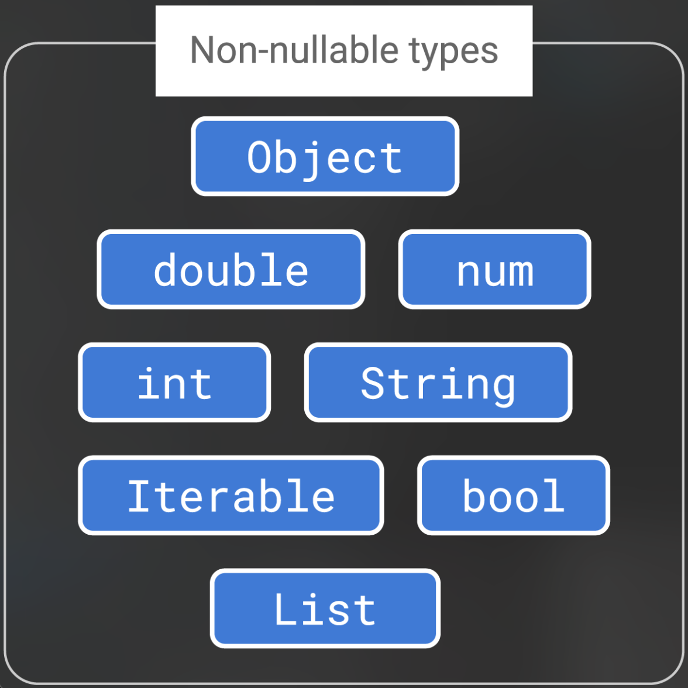
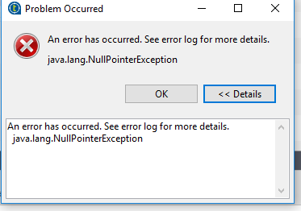
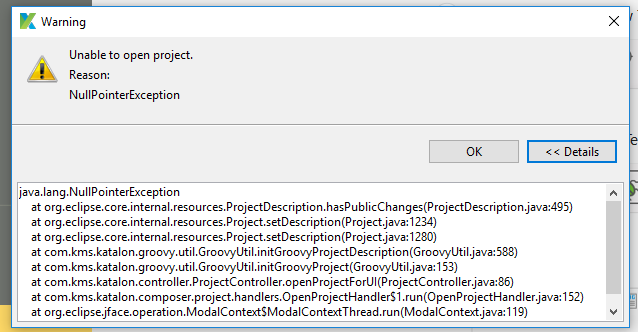
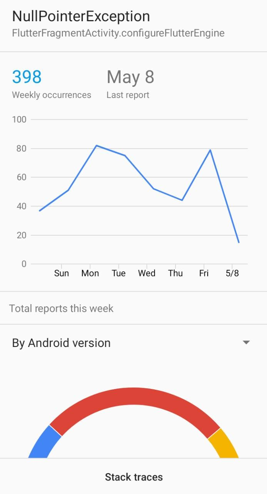
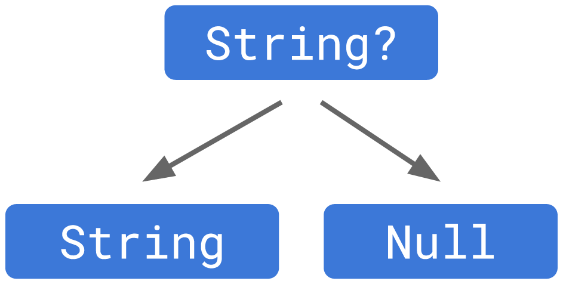
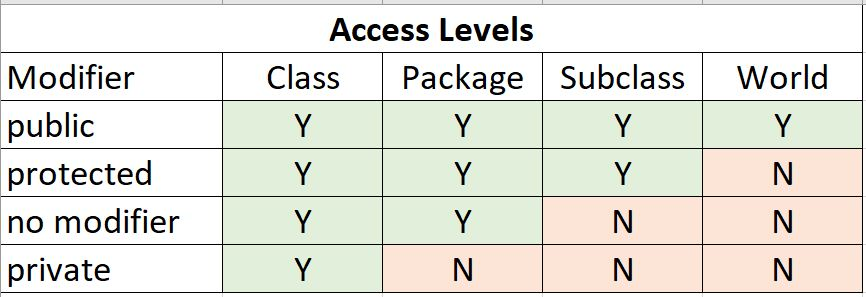

# Dart basic

## Nội dung chính:
1. [Dart Variables](#dart-variables)
- Các kiểu dữ liệu trong dart:
  - [String](#string)
  - [int](#int)
  - [double](#double)
  - [bool](#bool)
  - [array](#array)
  - [map](#map)
- [dynamic vs var](#dynamic-vs-var)
- [Function](#function)
- [Enum](#enum)
- [Tổng kết Dart Variables](#tổng-kết-dart-variables)
2. [Null safety](#null-safety)
- [Why Null safety?](#why-null-safety)
- [Null safety là gì?](#null-safety-là-gì)
3. [Access modifier](#access-modifier)
4. [For loop](#for-loop)
5. [Practise](#practise)

## Dart Variables

Các kiểu dữ liệu chính trong dart
\
&nbsp;

[](assets/images/non-nullable-types.png)


### String
1. Khái niệm:

Kiểu String trong Dart sử dụng để biểu diễn chuỗi ký tự Unicode(UTF-16) (bạn có thể sử dụng các xâu có kí tự tiếng Việt hoặc bất cứ thứ tiếng nào mà sử dụng được với mã Unicode.

Nhìn chung string trong dart giống các ngôn ngữ khác.

Cách khai báo và sử dụng:

```dart
void main(List<String> args) {
  /// Có thể sử dụng nháy đơn '' hoặc nháy kép "" để khai báo 1 string
  String s = 'Hello world';
  String s1 = "Hello world";
}
```

> :warning: **1 vài phương thức cần nhớ**: đa phần các phương thức của string trong dart đều giống so với java/kotlin/python....

- split()
- contains()
- toUpperCase(), toLowerCase()
- indexOf()
- startsWith()
- replaceAll()
- trim()

```dart
void main(List<String> args) {
  /// Có thể sử dụng nháy đơn '' hoặc nháy kép "" để khai báo 1 string
  String s = 'Hello world ';
  String s1 = "Hello world";

  /// Tách kí tự trong 1 chuỗi
  List<String> splittedStrs = s.split(" ");
  print("splittedStrs -> $splittedStrs"); // sẽ in ra: splittedStrs -> [Hello, world]

  /// kiểm tra 1 string có chứa 1 string khác không
  bool hasWorldStr = s.contains("world");
  print("hasWorldStr -> $hasWorldStr"); // sẽ in ra: hasWorldStr -> true

  /// chuyển đổi tất cả kí tự về kí tự viết hoa, viết thường
  String sUpperCase = s.toUpperCase();
  String sLowerCase = s.toLowerCase();
  print("sUpperCase -> $sUpperCase"); // sẽ in ra: sUpperCase -> HELLO WORLD
  print("sLowerCase -> $sLowerCase"); // sẽ in ra: sLowerCase -> hello world
  
  /// lấy vị trí đầu tiên của kí tự 'o'
  int sIndexOf = s.indexOf("o");
  print("sIndexOf -> $sIndexOf"); // sẽ in ra: sIndexOf -> 4

  /// kiểm tra xem string bắt đầu với kí tự 'H'
  bool sStartWith = s.startsWith("H");
  print("sStartWith -> $sStartWith"); // sẽ in ra: sStartWith -> true

  /// thay thế các kí tự trong 1 chuỗi
  String sReplaced = s.replaceAll("world", "everyone");
  print("sReplaced -> $sReplaced"); // sẽ in ra: sReplaced -> Hello everyone

  /// loại bỏ khoảng trắng ở đầu/cuối string
  String sTrimmed = s.trim();
  print("s -> \"$s\""); // sẽ in ra: s -> "Hello world "
  print("sTrimmed -> $sTrimmed"); // sẽ in ra: sTrimmed -> Hello world
}
```

\
&nbsp;

### int
int là kiểu số nguyên. Tùy thuộc vào bộ nhớ máy, nền tảng máy (32 bit hay 64 bit) mà kiểu số nguyên trong Dart có giá trị từ -2^63 đến 2^63 - 1. Ngoài kiểu số nguyên int, trong Dart còn có kiểu số nguyên BigInt để làm việc với các số nguyên lớn.

BigInt khá giống với BigInteger trong java, phù hợp để lưu trữ các số nguyên lớn, như số tiền lạm phát ở Venezuela

```dart
void main(List<String> args) {
  int a = 10;
  int b = -10;

  print("a = $a"); // sẽ in ra: a = 10
  print("b = $b"); // sẽ in ra: b = -10
}
```

\
&nbsp;

### double
1. Khái niệm:

double là kiểu số thực. Các phiên bản cũ của Dart thì kiểu số thực bắt buộc phải có dấu . ví dụ để khai báo biến số thực a có giá trị 10 chúng ta phải viết rõ double a = 10.0 Tuy nhiên các phiên bản hiện nay đã bỏ phần dấu . này đi, bạn có thể khai báo double a = 10

Trong dart sẽ không có Float như java.

```dart
void main(List<String> args) {
  double a = 10;
  double b = -10.0;

  int c = 10;
  int d = -10;

  int _resultInt = (a + b + c + d).toInt();
  double _resultDouble = (a + b + c + d);

  print("_resultInt -> $_resultInt"); // sẽ in ra: _resultInt -> 0
  print("_resultDouble -> $_resultDouble"); // sẽ in ra: _resultInt -> 0.0
}
```
2. Tổng kết:

> :warning: **1 vài phương thức cần nhớ**: để chuyển đổi giữa các kiểu dữ liệu
- toInt()
- toString()
- toDouble()
- parseInt(), int.tryParse()
- parseDouble(), double.tryParse()

Chuyển đổi từ int, double sang string:
```dart
void main(List<String> args) {
  int a = 10;
  double b = -10.0;

  String _aStr = a.toString();
  String _bStr = b.toString();

  print("int a toString: $_aStr"); // sẽ in ra: int a toString: 10

  print("double b toString: $_bStr"); // sẽ in ra: double b toString: -10.0
}
```

Chuyển từ int qua double:
```dart
void main(List<String> args) {
  int a = 10;
  double _aDouble = a.toDouble();

  print("int a toDouble: $_aDouble"); // sẽ in ra: int a toDouble: 10.0
}
```

Chuyển từ double qua int:
```dart
void main(List<String> args) {
  double b = -10.0;
  int _bInt = b.toInt();

  print("double b toInt: $_bInt"); // sẽ in ra: double b toDouble: -10
}
```

Chuyển từ String qua double, int:
```dart
void main(List<String> args) {
  String c = "20";

  int _cInt = int.parse(c);
  double _cDouble = double.parse(c);

  print("Parse String c to int: $_cInt"); // sẽ in ra: Parse String c to int: 20
  print("Parse String c to double: $_cDouble"); // sẽ in ra: Parse String c to double: 20.0
}
```

\
&nbsp;

### bool
Kiểu dữ liệu bool trong Dart có 2 giá trị là true (đúng) và false (sai) được sử dụng để thể hiện kết quả của một mệnh đề logic (các phép toán so sánh, kiểm tra, các hàm…)

```dart
void main(List<String> args) {
  bool a = true;
  bool b = false;

  if (a) { /// các viết tắt khi so sánh bool == true
    print("a is $a"); // sẽ in ra: a is true
  }

  if (a == true) { /// viết kiểu này rõ nghĩa hơn
    print("a == true"); // sẽ in ra: a == true
  }

  if (!b) { /// cách viết tắt khi so sánh bool == false
    print("b is $b"); // sẽ in ra: b is false
  }

  if (a && !b) { /// so sánh nhiều mệnh đề, viết tắt
    print("a == true and b == false"); // sẽ in ra: a == true and b == false
  }

  if (a || b) { /// so sánh nhiều mệnh đề, viết tắt
    print("a == true or b == true"); // sẽ in ra: a == true and b == false
  }
}
```

\
&nbsp;

### array
1. Khái niệm:

Kiểu dữ liệu array (danh sách - List) trong Dart được sử dụng để biểu diễn cho một tập hợp các đối tượng theo một thứ tự nhất định. Kiểu array trong Dart tương đương với kiểu mảng Array trong các ngôn ngữ khác (java, kotlin).

Cách khai báo
```dart
void main(List<String> args) {
  List strs = ["a", "b", "c"]; /// cách viết tắt
  List<String> strs_1 = <String>["a", "b", "c"]; /// cách viết tắt rõ nghĩa, sử dụng [generic]
}
```

> :warning: **1 vài phương thức cần nhớ** khi làm việc với array
- add()
- addAll()
- remove()
- subList()

Thêm mới / xoá 1 phần tử vào array
```dart
void main(List<String> args) {
  List strs = ["a", "b", "c"]; /// cách viết tắt
  List<String> strs_1 = <String>["a", "b","c"]; /// cách viết tắt rõ nghĩa, sử dụng [generic]

  strs.add("d");
  print("strs after adding \"d\" -> $strs");
  // sẽ in ra: strs after adding "d" -> [a, b, c, d]

  strs.remove("d");
  print("strs after removing \"d\" -> " + strs.toString()); 
  // sẽ in ra: strs_1 after adding "d" -> [a, b, c, d]

  /// đoạn code trên, nhưng sử dụng [Builder Design Pattern] để viết code ngắn gọn hơn
  print("strs after adding \"d\" then remove \"d\" -> ${strs..add("d")..remove("d")}"); 
  // sẽ in ra: strs after adding "d" then remove "d" -> [a, b, c]
}
```

Thêm 1 array khác:
```dart
void main(List<String> args) {
  List<String> strs_1 = <String>["a", "b","c"]; /// cách viết tắt rõ nghĩa, sử dụng [generic]


  List<String> strs_2 = ["d", "e", "f"];
  strs_1.addAll(strs_2);
  print("strs_1 after addAll str_2 -> $strs_1");
  // sẽ in ra: strs_1 after addAll str_2 -> [a, b, c, d, e, f]
}
```

Tách các phần tử thành 1 array từ 1 array:
```dart
void main(List<String> args) {
  List<String> strs_1 = <String>["a", "b","c"]; /// cách viết tắt rõ nghĩa, sử dụng [generic]
  
  
  List<String> strs_1_subList = strs_1.sublist(2, 4);
  print("strs_1_subList -> $strs_1_subList");
  // sẽ in ra: strs_1_subList -> [c, d]
}
```

Lấy 1 phần tử từ 1 array:
```dart
void main(List<String> args) {
  List<String> strs_1 = <String>["a", "b","c"
  ]; /// cách viết tắt rõ nghĩa, sử dụng [generic]
  

  /// lấy 1 phần tử tại 1 vị trí index trong array
  String _strByIndex = strs_1[0];
  print("_strByIndex -> $_strByIndex");
  // sẽ in ra: _strByIndex -> a
}
```

2. Tổng kết

Dart cũng giống các ngôn ngữ lập trình khác như java, kotlin...đều hỗ trợ các phương thức nâng cao cho array như:
- map, reduce, every, skip, take
- where, firstWhere, indexWhere
- fillRange, insert, insertAll

> :warning: **1 vài phương thức cần nhớ** khi làm việc với array
- add()
- addAll()
- remove()
- subList()

\
&nbsp;

### map
1. Khái niệm

Kiểu dữ liệu map trong dart là một đối tượng lưu trữ dữ liệu dưới dạng một cặp khóa-giá trị. Mỗi giá trị được liên kết với khóa của nó và nó được sử dụng để truy cập giá trị tương ứng của nó. Cả khóa và giá trị đều có thể là bất kỳ loại nào

Khai báo 1 map
```dart
void main(List<String> args) {
  /// cách viết ngắn gọn
  Map map = {"key": "value"};
  print("map -> $map");
  // sẽ in ra: map -> {key: value}
  
  /// cách viết rõ nghĩa
  Map<String, String> map1 = Map<String, String>();
  map1["key"] = "value";
  print("map1 -> $map1");
  // sẽ in ra: map1 -> {key: value}
}
```

Trong dart cũng có hỗ trợ HashMap như các ngôn ngữ lập trình khác: java, kotlin
\
&nbsp;

1 vài phương thức cơ bản:

```dart
void main(List<String> args) {
  Map<String, String> map1 = Map<String, String>();
  map1["key"] = "value";
  print("map1 -> $map1"); // sẽ in ra: map1 -> {key: value}

  /// 1 vài phương thức cơ bản
  Map<String, String> map2 = Map.from(map1);
  print("map2 -> $map2"); // sẽ in ra: map2 -> {key: value}

  String key = map1.keys.first;
  print("key from map1 -> $key"); // key from map1 -> key

  String value = map1.values.first;
  print("value from map1 -> $value"); // sẽ in ra: value from map1 -> value

  /// trong map key là duy nhất, không thể có 2 key cùng giá trị
  Map map12 = map1..addAll(map2);
  print("map12 -> $map12"); // sẽ in ra: map12 -> {key: value}
}
```

Map lưu trữ theo key-value. Vậy có thể thêm 1 cặp key-value trùng với cặp key-value đã tồn tại trong map không?
```dart
void main(List<String> args) {
  /// điều gì sẽ xảy ra nếu add 1 map với key mới?
  Map mapWithNewValue = {"key": "value"}..addAll({"key": "newValue"});
  print("mapWithNewValue -> $mapWithNewValue");
  // sẽ in ra: mapWithNewValue -> {key: newValue}
}
```

> :warning: **Cần chú ý**:
- Map lưu trữ dữ liệu theo key-value
- Key trong map không thể trùng. Nếu thêm 1 map khác có cùng key, value sẽ được cập nhật lại.

2. Tổng kết:
- Map lưu trữ dữ liệu theo key-value
- Key trong map không thể trùng. Nếu thêm 1 map khác có cùng key, value sẽ được cập nhật lại.

\
&nbsp;

## dynamic vs var
1. Khái niệm

Trong Dart mọi thứ đều là object. Đã là object thì luôn phải là instance của một class nào đó. Vì tất cả là đều là object nên dù là số, chữ hay bất kể loại dữ liệu nào thì giá trị mặc định của nó đều là `null`. Nhờ vậy, mọi biến số trong Dart đều là `reference type`. Cũng chính vì thế mà Dart có một loại biến dynamic chấp nhận mọi kiểu dữ liệu.

Dùng var để khai báo các kiểu dữ liệu:
```dart
void main(List<String> args) {
  /// Khai báo biến var
  /// Ưu điểm: nhanh, và không cần quan tâm tới [runtimeType]
  var intVar = 10;
  print("intVar -> $intVar, loại dữ liệu (variableType) -> ${intVar.runtimeType}");
  // sẽ in ra: intVar -> 10, loại dữ liệu (variableType) -> int

  var doubleVar = 10.0;
  print("doubleVar -> $doubleVar, loại dữ liệu (variableType) -> ${doubleVar.runtimeType}");
  // sẽ in ra: doubleVar -> 10.0, loại dữ liệu (variableType) -> double

  var stringVar = "A";
  print("stringVar -> $stringVar, loại dữ liệu (variableType) -> ${stringVar.runtimeType}");
  // sẽ in ra: stringVar -> A, loại dữ liệu (variableType) -> String

  var boolVar = 10;
  print("boolVar -> $boolVar, loại dữ liệu (variableType) -> ${boolVar.runtimeType}");
  // sẽ in ra: boolVar -> 10, loại dữ liệu (variableType) -> int

  var arrayVar = [1, 2, 3];
  print("arrayVar -> $arrayVar, loại dữ liệu (variableType) -> ${arrayVar.runtimeType}");
  // sẽ in ra: arrayVar -> [1, 2, 3], loại dữ liệu (variableType) -> List<int>

  var mapVar = {"key": "value"};
  print("mapVar -> $mapVar, loại dữ liệu (variableType) -> ${mapVar.runtimeType}");
  // sẽ in ra: mapVar -> {key: value}, loại dữ liệu (variableType) -> _InternalLinkedHashMap<String, String>
}
```

Dùng dynamic để khai báo các kiểu dữ liệu
```dart
void main(List<String> args) {
  /// Khai báo biến dynamic
  /// Giống var, nhưng có thể thay đổi variable type
  dynamic dynamicA = 10;
  print("dynamicA -> $dynamicA, loại dữ liệu (variableType) -> ${dynamicA.runtimeType}");
  // sẽ in ra: dynamicA -> 10, loại dữ liệu (variableType) -> int

  dynamicA = 10.0;
  print("dynamicA -> $dynamicA, loại dữ liệu (variableType) -> ${dynamicA.runtimeType}");
  // sẽ in ra: dynamicA -> 10.0, loại dữ liệu (variableType) -> double

  dynamicA = "A";
  print("dynamicA -> $dynamicA, loại dữ liệu (variableType) -> ${dynamicA.runtimeType}");
  // sẽ in ra: dynamicA -> A, loại dữ liệu (variableType) -> String

  dynamicA = true;
  print("dynamicA -> $dynamicA, loại dữ liệu (variableType) -> ${dynamicA.runtimeType}");
  // sẽ in ra: dynamicA -> true, loại dữ liệu (variableType) -> bool

  dynamicA = [1, 2, 3];
  print("dynamicA -> $dynamicA, loại dữ liệu (variableType) -> ${dynamicA.runtimeType}");
  // sẽ in ra: dynamicA -> [1, 2, 3], loại dữ liệu (variableType) -> List<int>

  dynamicA = {"key": "value"};
  print("dynamicA -> $dynamicA, loại dữ liệu (variableType) -> ${dynamicA.runtimeType}");
  // sẽ in ra: dynamicA -> {key: value}, loại dữ liệu (variableType) -> _InternalLinkedHashMap<String, String>


  /// error khi chạy, vì dynamicA hiện tại là Map, không có phương thức toInt()
  var a = dynamicA.toInt();
  print("a -> $a");
  // sẽ in ra: Class '_InternalLinkedHashMap<String, String>' has no instance method 'toInt'

  /*
   - dynamic đúng với cái tên của nó, có thể sử dụng linh hoạt trong rất nhiều trường hợp
   - Nhưng đây vừa là ưu điểm, vừa là nhược điểm:
      - Trong ví dụ trên, nếu không check [runtimeType] thì khó mà biết được variable type của dynamic,
      điều này dễ dẫn tới việc sử dụng sai phương thức
  */
}
```

Tác dụng của var/dynamic, cùng xem ví dụ sau:

```dart
void main(List<String> args) {
  Test test = Test().instance(); // phải chỉ rõ rằng hàm `instance` trả về đối tượng `Test`
  
  var a = Test().instance(); // không cần quan tâm tới `variable type` của hàm `instance`

  /// sử dụng var/dynamic thích hợp cho việc trung chuyển các `variable`
  /// tức chuyển từ hàm này qua hàm khác, class này qua class khác
}

class Test{
  Test instance(){return this;}
}
```

Dart cũng như các ngôn ngữ lập trình khác đều hỗ trợ các keyword như:
- const
- final
- late
- static

```dart
void main(List<String> args) {
  const a = 10;
  final b = "b";
  late String c;

  a = 20; // vì a là const, nên không thể thay đổi giá trị

  void initB(){
    b = 10; // vì b là final, nên không thể thay đổi giá trị
  }

  initB();

  void initC(){
    c = "c";
  }

  initC();
}

class A {
  static bool d = false;
}
```

2. Tổng kết
- Nên hạn chế sử dụng dynamic
- Trong dart cũng hỗ trợ static, final, late, const

\
&nbsp;

## Function
1. Khái niệm

Hàm là một khối lệnh thực hiện một tác vụ, khối lệnh này được dùng nhiều lần nên gom chúng tại thành một hàm. Trong Dart mọi thứ đều là đối tượng nên hàm cũng là một đối tượng (kế thừa Function).

```dart
  /// viết và gọi function (hàm)
  /// cách gọi hàm phổ biến
  test("cách gọi hàm phổ biến"); // sẽ in ra: Đây là hàm test, params test: cách gọi hàm phổ biến

  void test(String test){
    print("Đây là hàm test, params test: $test");
  }
```

Cách viết khác:
```dart
  /// vì trong dart, mọi thứ đều là đối tượng,
  /// và hàm kế thừa Function, nên có thể viết như này
  test.call("gọi qua method call()"); // sẽ in ra: Đây là hàm test, params test: gọi qua method call()

  void test(String test){
    print("Đây là hàm test, params test: $test");
  }
```

Function cũng có thể truyền vào như 1 params:
```dart
void main(List<String> args) {
  /// hoặc có thể truyền vào như 1 parameter....
  functionTest(() => test("function call function"));
  // sẽ in ra: Đây là hàm test, params test: function call function


  var _ret = functionTestCallBack(parseStringFromInt);
  print("Kết quả khi gọi functionTestCallBack -> $_ret");
  // sẽ in ra: Kết quả khi gọi functionTestCallBack -> Kết quả thực thi function: -1


  var _ret1 = functionTestCallBack((intStr) => parseStringFromInt("10"));
  print("Kết quả khi gọi functionTestCallBack -> $_ret1");
  // sẽ in ra: Kết quả khi gọi functionTestCallBack -> Kết quả thực thi function: 10
}

void test(String test){
  print("Đây là hàm test, params test: $test");
}

int parseStringFromInt(String number){
  return int.tryParse(number) ?? -1;
}

void functionTest(Function function){
  function.call();
}

/// [functionTestCallBack] sẽ thực thi như sau:
/// - Yêu cầu truyền vào 1 function với parameter là 1 string
/// - Thực thi function [callback] và trả về dữ liệu kiểu int
/// - Trả về kiểu dữ liệu sau khi thực thi function [functionTestCallBack] dạng String
String functionTestCallBack(int Function(String) callback){
  int result = callback.call(""); // "" là default value

  return "Kết quả thực thi function: $result";
}
```

Params trong function
``` dart
void main(List<String> args) {
  /// function trong dart hỗ trợ optional params,
  /// - nếu không truyền params vào function: params sẽ nhận giá trị mặc định
  /// - nếu truyền params vào function: params sẽ nhận giá trị được truyền vào từ function
  functionWithOptionalParam();
  // sẽ in ra: params a=a, b=b
  
  functionWithOptionalParam(
    b: "không phải giá trị b",
    a: "không phải giá trị a"
  );
  // sẽ in ra: params a=không phải giá trị a, b=không phải giá trị b

  functionWithPositionalParam("a", "b", "c");
  // sẽ in ra: params a=a, b=b, b=c, d=
  /// vì không truyền vào d, nên d=""
}

void functionWithOptionalParam({String a = "a", String b = "b"}){
  print("params a=$a, b=$b");
}
void functionWithPositionalParam(String a, [String b = "", c = "", d = ""]){
  print("params a=$a, b=$b, b=$c, d=$d");
}
```

Inline function: function trong function
```dart
void main(List<String> args) {
  /// Inline function (function lồng function trong dart)
  /// [_inlineFunction2] được định nghĩa bên trong function [_inlineFunction1]
  /// Lúc này chỉ có thể call function [_inlineFunction2] trong function [_inlineFunction2]
  void _inlineFunction1(){
    print("_inlineFunction1");

    void _inlineFunction2(){
      print("_inlineFunction2");
    }

    _inlineFunction2();
  }
  _inlineFunction1();
  // sẽ in ra: _inlineFunction1
  // sẽ in ra: _inlineFunction2
}
```

Mở rộng function từ 1 class
```dart
void main(List<String> args) {
  /// Dart có hỗ trợ extension như kotlin, swift...:
  /// function [test] được viết thêm vào lớp String
  String a = "a";
  a.test();
  // sẽ in ra: Mở rộng function trên lớp String
}

extension stringExt on String{
  void test(){
    print("Mở rộng function trên lớp String");
  }
}
```


2. Tổng kết

- Function cũng là 1 object trong dart.
- Khi tạo inline function, cần chú ý tới việc đặt tên hàm và nên tuân thủ clean code (1 function không dài quá 20 line, 1 line không nên quá 80 kí tự)
- Function với optional params linh hoạt trong hầu hết các trường hợp.
- Function với positioned params sẽ khó mở rộng trong tương lai.
Ví dụ 1 function với positioned params, sẽ không khả thi khi cần truyền thêm params khác variable type.
&nbsp;

### Enum
Kiểu enum trong Dart còn gọi là kiểu liệt kê (kiểu liệt kê thứ tự enumerated) được sử dụng để liệt kê các giá trị hằng số. Kiểu liệt kê được khai báo bằng cách sử dụng từ khóa enum. Kiểu liệt kê enum cũng là một kiểu iterable, tức là cũng có thể duyệt tuần tự qua từng phần tử của nó.

Ví dụ khai báo enum và thêm function `getName()`

```dart
enum DayOfWeeks {
  Monday,
  Tuesday,
  Wednesday,
  Thursday,
  Friday,
  Saturday,
  Sunday,
}

extension DayOfWeeksExt on DayOfWeeks {
  String getName() {
    switch (this) {
      case DayOfWeeks.Monday:
        return "Thứ 2";
      case DayOfWeeks.Tuesday:
        return "Thứ 3";
      case DayOfWeeks.Wednesday:
        return "Thứ 4";
      case DayOfWeeks.Thursday:
        return "Thứ 5";
      case DayOfWeeks.Friday:
        return "Thứ 6";
      case DayOfWeeks.Saturday:
        return "Thứ 7";
      case DayOfWeeks.Sunday:
        return "Chủ nhật";
      default:
        return "Không xác định";
    }
  }
}

void main(List<String> args) {
  List<DayOfWeeks> dayOfWeeks = DayOfWeeks.values;
  dayOfWeeks.forEach((element) {
    print("day is: ${element.getName()}");
    // sẽ in ra: các ngày từ thứ 2 -> chủ nhật
    // day is: Thứ 2
    // day is: Thứ 3
    // day is: Thứ 4
    // day is: Thứ 5
    // day is: Thứ 6
    // day is: Thứ 7
    // day is: Chủ nhật
  });
}
```

\
&nbsp;
## Tổng kết Dart Variables
Hầu hết các biến trong dart giống với các ngôn ngữ lập trình khác như: java, kotlin, python

Các biến trong dart, mặc định đều là non-nullable, tức không thể có giá trị null.

\
&nbsp;

## Null safety

Tôi vẫn nhớ những ngày đầu tiên code java, hầu hết lỗi tôi mắc phải là Null Pointer Exception, nhìn nhiều tới quen....1 thời gian sau, khi đi làm ở 1 vài công ty, khi xem các báo cáo về bugs ở công ty, tôi mới phát hiện ra 80% bugs hiện tại các developer mắc phải đều do Null Pointer Exception
\
&nbsp;

### Why Null safety?

Xin mượn tạm 1 vài hình ảnh bên phía java
\
&nbsp;

[](assets/images/null_pointer_exception_1.png)
\
&nbsp;

[](assets/images/null_pointer_exception_2.png)
\
&nbsp;

[](assets/images/null_pointer_exception_report.jpeg)
\
&nbsp;


Từ khi chuyển qua Flutter, tôi dùng version 1.12.13, lúc đó tôi chưa thực sự có niềm tin vào Flutter, vì chưa có Null Safety, nhưng từ version 2.0 trở lên, Flutter hiện tại đã khác xưa.

Trong dart chia rõ `Non-Nullable Variables`, tức các biến không thể null, và `Nullable Variables`, tức các biến có thể nhận giá trị null

\
&nbsp;
[](assets/images/non-nullable-vs-nullable-types.png)

\
&nbsp;
Cùng tìm hiểu về Nullable Variables qua ví dụ sau nhé
```dart
void main(List<String> args) {
  /// khi áp dụng `Null safety`, không thể khai báo string s = null
  /// theo cách thông thường;
  String s = null; // sẽ báo lỗi, vì String ở đây không thể nhận giá trị null
  String? sCanBeNull = null;
  print("sCanBeNull -> $sCanBeNull"); // sẽ in ra sCanBeNull -> null
}
```

\
&nbsp;
[](assets/images/string-nullable-hierarchy.png)

Như vậy, Flutter đã tách biệt rõ biến nào có thể nhận giá trị Null, biến nào không thể nhận giá trị Null ngay từ khi được khởi tạo.

Cùng xem ví dụ tiếp theo khi áp dụng các hàm nhé:

```dart
void main(List<String> args) {
  String? sCanBeNull = null;
  List<String> splitteds = sCanBeNull.split("");
  /// với biến có thể null khi thực thi 1 hàm, sẽ báo lỗi để tránh `Null Pointer Exception`
  /// The method 'split' can't be unconditionally invoked because the receiver can be 'null'.
  
  /// Chúng ta buộc phải kiểm tra `sCanBeNull` != null,
  List<String> splitteds_1 = sCanBeNull?.split("") ?? []; 
  /// ?? là Null-aware, sẽ giải thích ở phía dưới

  /// Hoặc có 1 cách nữa là chắc chắn rằng giá trị hiện tại của `sCanBeNull` không phải null
  List<String> splitteds_2 = sCanBeNull!.split(""); 
}
```

Qua 2 ví dụ trên, tôi tin mọi người đã thấy được lợi ích mà Null Safety mang lại

\
&nbsp;

### Null-aware

Được thể hiện bằng dấu '??'. Hiểu nôm na là nếu biểu thức bên trái dấu '??' bị null, thì sẽ lấy giá trị ở bên phải dấu '??'

```dart
void main(List<String> args) {
  String? sCanBeNull = null;
  List<String> splitteds_3 = sCanBeNull?.split("") ?? []; 
  /// ở đây, sẽ thực thi như sau:
  /// Nếu `sCanBeNull` != null sẽ gọi hàm split("") và trả về giá trị
  /// Nếu `sCanBeNull` == null sẽ trả về giá trị []
  
  /// 1 vài ví dụ về `Null-aware`
  sCanBeNull ??= "Value"; // nếu sCanBeNull = null, sCanBeNull = "Value"
  sCanBeNull ??= "Test"; // sCanBeNull sẽ không được cập nhật, vì giá trị hiện tại = "Value"
  print("sCanBeNull -> $sCanBeNull");
}
```

\
&nbsp;

## Access modifier

Trong các ngôn ngữ lập trình như kotlin, java, swift thường chia Access modifier thành 4 levels:

\
&nbsp;

[](assets/images/java_access_modifiers.jpeg)

Trong dart, chỉ tồn tại duy nhất 2 levels: public và private

```dart
import 'test.dart';

void main(List<String> args) {
  /// để khai báo biến private, sử dụng underscrore `_`
  /// _a có thể truy cập từ hàm main
  InMainClass inMainClass = InMainClass();
  inMainClass._a; // _a là biến private trong class A, nhưng nằm cùng file với 


  /// ở 1 trường hợp khác, _a không thể truy cập, vì nằm ở file khác, chú ý phần import 'test.dart';
  Test test = Test();
  test._a; // ở 1 trường hợp khác, _a không thể truy cập, vì nằm ở file khác, chú ý phần import 'test.dart';


  /// khi sử dụng inline function, cần chú ý tới access modifiers
  /// không thể truy cập các biến nằm trong inline function
  void function(){
    String inFunction = inMainClass._a; // có thể truy cập
  }

  String outFunction = inFunction; // không thể truy cập
}

class InMainClass {
  String _a = "";
}
```

\
&nbsp;
Tổng kết
- Trong dart chỉ có duy nhất 2 access modifiers levels: public và private, mặc định là public
- Khi sử dụng inline function, cần chú ý tới access modifier, khi ở ngoài inline function sẽ không thể truy cập các biến nằm trong inline function.

\
&nbsp;

## For loop
Trong các ngôn ngữ lập trình, vòng lặp cho phép một khối mã được thực thi lặp đi lặp lại nhiều lần.

Dart cũng như các ngôn ngữ lập trình khác, đều hỗ trợ các vòng lặp
- for
- for in
- while
- do while

For: áp dụng theo các điều kiện
```dart
void main() {
  /// vòng for cơ bản, theo index
  for (int i = 0; i < 10; i = i + 1) {
    print('i= $i');
    // sẽ in ra giá trị của i từ 0 -> 9
    /*
      i= 0
      i= 1
      i= 2
      i= 3
      i= 4
      i= 5
      i= 6
      i= 7
      i= 8
      i= 9
    */
  }
}
```

\
&nbsp;
For in: áp dụng lặp từng phần tử trong mảng
```dart
void main(List<String> args) {
  List ints = [0, 1, 2, 3, 4, 5, 6, 7, 8, 9];
  /// cũng là vòng lặp nhưng lặp qua từng giá trị trong 1 mảng
  for (int i in ints) {
    print("i = $i"); 
    // sẽ in ra giá trị của i 0 -> 9
    /*
      i = 0
      i = 1
      i = 2
      i = 3
      i = 4
      i = 5
      i = 6
      i = 7
      i = 8
      i = 9
    */
  }
}
```

While: áp dụng cho 1 điều kiện chưa thể xác định, chỉ có thể xác định khi thực thi 1 hoặc nhiều khối lệnh

```dart
void main(List<String> args) {
  int x = 0;
  // trong khi 1 điều kiện đúng, thực thi 1 khối lệnh
  while (x < 10){
    x++;
    print("x -> $x");
    // sẽ in ra các giá trị từ 1 -> 10,
    // khi x = 10, while sẽ dừng, vì điều kiện để chạy while là x < 10
  }
}
```

do while:
```dart
void main(List<String> args) {
  int x = 0;
  /// thực thi khối lệnh trước khi kiểm tra điều kiện trong while
  do {
    x++;
    print("x -> $x"); // sẽ in ra giá trị của x từ 1 -> 10
  } while (x > 0 && x < 10);  
}
```

> :warning: **Chú ý**
Khi sử dụng vòng lặp, cần chú ý các điều kiện lặp để hạn chế `infinity loop` gây treo, lag ứng dụng.

\
&nbsp;

Tổng kết:
Vòng lặp trong dart giống các ngôn ngữ lập trình phổ biến khác như: java, kotlin, swift, python....

\
&nbsp;

## Practise
- Viết 1 chương trình:
  1. Khai báo toàn bộ các kiểu dữ liệu: Non-Nullable Types và Nullable Types, dynamic, var
  2. Có sử dụng các từ khoá static, final, late const
  3. Viết các hàm chuyển đổi qua lại giữa string, int, double. Ví dụ:
  \
  &nbsp;
  ```dart
    String getIntFromString(int input){
      return input.toString();
    }
  ```
  4. Viết 1 hàm tính giai thừa của 6