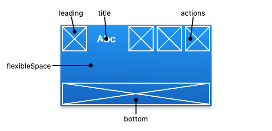
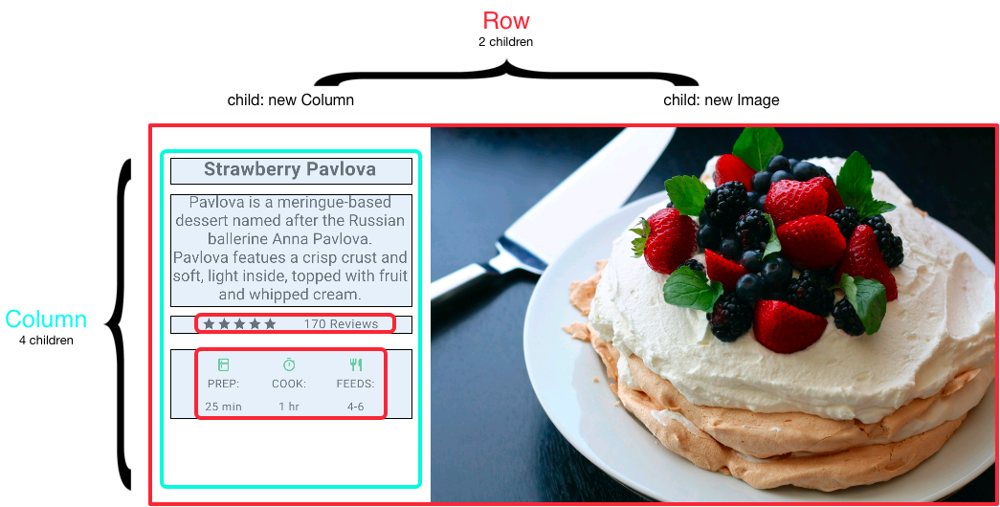
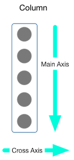

# Dart Widget

## Nội dung chính:
1. [Tổng quan về widget trong Flutter](#tổng-quan-về-widget-trong-flutter)
2. [StatelessWidget vs StatefulWidget](#statelesswidget-vs-statefulwidget)
- [StatelessWidget](#statelesswidget)
- [StatefulWidget](#statefulwidget)
- [Life cycle](#life-cycle)

3. [Các widget cơ bản](#các-widget-cơ-bản-trong-flutter)
  - [Scafford](#scaffold)
  - [Appbar](#appbar)
  - [Text](#text)
  - [Icon](#icon)
  - [Image](#image)
  - [Container](#container)
  - [SizedBox](#sizedbox)
  - [Column-row](#column-row)

\
&nbsp;

## Tổng quan về widget trong Flutter
Trong Flutter, các widget được lồng vào nhau để xây dựng giao diện hoàn chỉnh cho ứng dụng, mỗi widget sẽ đóng 1 vai trò riêng. 1 tập hợp của nhiều widget được gọi là widget tree.

Ví dụ 1 màn hình được build trên iphone simulator

[](assets/images/widget_tree_example_ios.png)

\
&nbsp;
sẽ có Widget tree như thế này:

- Trong devtool

[](assets/images/devtool_widget_tree_example.png)

\
&nbsp;

- Trong VsCode

[](assets/images/vscode_widget_tree_example.png)

\
&nbsp;

Để bắt đầu xây dựng giao diện ứng dụng trong Flutter, chúng ta cần khai báo:

```dart
void main(List<String> args) {
  runApp(const App());
}
```

đầu vào của hàm `runApp` là 1 Widget.

Trong Flutter, widget được chia làm 2 loại `StatelessWidget` và `StatefulWidget`

\
&nbsp;


## StatelessWidget vs StatefulWidget

### StatelessWidget
StatelessWidget không có state. Nó không chấp nhận sự thay đổi bên trong nó. Còn đối với sự thay đổi từ bên ngoài (widget cha) thì nó sẽ thụ động thay đổi theo.

Có nghĩa là StatelessWidget chỉ đơn thuần nhận dữ liệu và hiển thị 1 cách thụ động. Việc tương tác với nó không sinh ra bất kỳ một event nào để chính bản thân phải render lại. Nếu phải render lại thì là do tác động từ bên ngoài vào.

> :warning: *Để tạo nhanh 1 StatelessWidget trong vscode, ta có thể dùng phím tắt `STL` rồi `Enter`*
> \
> &nbsp;
>[](assets/gif/widget_stl.gif)

Khi sử dụng `StatelessWidget` chúng ta cần override lại phương thức `build()`

```dart
...
@override
Widget build(BuildContext context) {
  return Container();
}
...
```

\
&nbsp;

### StatefulWidget
Trái với StatelessWidget thì StatefulWidget là Widget có trạng thái, cũng là Widget có sẵn trong Flutter SDK. Vậy StatefulWidget có nghĩa là Widget có `State` hay Widget có trạng thái.

Chúng ta có thể dễ dàng cập nhật lại dữ liệu với StatefulWidget qua phương thức `setState()`

\
&nbsp;

> :warning: *Để tạo nhanh 1 StatefulWidget trong vscode, ta có thể dùng phím tắt `STF` rồi `Enter`*
> \
> &nbsp;
>[](assets/gif/widget_stf.gif)

\
&nbsp;
Cùng quay lại ví dụ khi `generate new project` của vscode

```dart
...
void _incrementCounter() {
    setState(() {
      _counter++;
    });
  }
...
```

khi hàm `setState()` được gọi, biến `_counter` sẽ được cập nhật giá trị, và toàn bộ cây thư mục sẽ được render lại.

Ở đây mình nhấn mạnh là toàn bộ case thư mục, chứ không phải chỉ:

```dart
...
Text(
  '$_counter',
  style: Theme.of(context).textTheme.headline4,
)
...
```

điều đó đồng nghĩa với việc 1 StatefulWidget A chứa 10 widget con, thì khi gọi hàm `setState()`, 10 widget con nằm trong A cũng có thể bị `render` (vẽ lại). Điều này sẽ gây ảnh hưởng không nhỏ tới `performance` (hiệu năng) ứng dụng. Để tránh điều này, ta có thể sử dụng từ khoá `const` cho những widget với dữ liệu cố định.

[](assets/images/widget_warning_setState.png)

Ở hình ảnh trên, `STLWidget1` không thể khai báo với từ khoá `const` nên sẽ bị render lại khi gọi hàm `setState()` vì STLWidget1 truyền vào 1 params a

Nhưng với `STLWidget2` được khai báo với từ khoá `const` sẽ không bị render lại khi gọi hàm `setState()`

[](assets/images/widget_warning_setState_1.png)


> :warning: **Khi sử dụng `setState()` trong StatefulWidget cần hết sức lưu ý về cây thư mục và tính toán các phương án mở rộng trong tương lai** Để tránh việc này, ta cần chú ý khai báo Widget với từ khoá `const` khi có thể

\
&nbsp;
### Life cycle
Vòng đời ứng dụng Flutter thực ra chỉ là tên gọi cho một chu trình quản lý trạng thái (State) của một màn hình ứng dụng.

Một ứng dụng Flutter có nhiều màn hình khác nhau và mỗi màn hình đều có sự thiết lập chu trình quản lý trạng thái ( State).

Như vậy khái niệm vòng đời ứng dụng trong Flutter, chính là vòng đời của trạng thái (State) .
Vì là quản lý theo trạng thái ( State) nên chúng ta chia làm hai loại có state ( Stateful ) và không có State (Stateless).

\
&nbsp;

Với StatelessWidget chỉ đơn thuần là nhận và hiển thị dữ liệu, không liên quan tới `State` nên StatelessWidget không có vòng đời

Việc ghi đè phương thức `build` là dùng để render Graphic UI( user interface), hiển thị lên màn hình cho người dùng.

\
&nbsp;

Xây dựng màn hình ứng dụng dùng StatefulWidget tức là liên quan đến việc quản lý State. Vì vậy nó cần chu trình quản lý trạng thái.

Trong một vòng đời của StatefulWidget có 7 trạng thái:
- createState: Khi tạo class kế thừa đến StatefulWidget, hàm khởi tạo sẽ được yêu cầu gọi đầu tiên, bằng cách ghi đè phương thức createState.

```dart
 @override
  _MyHomePageState createState() => _MyHomePageState();
```
- initState: Hàm này được gọi ngay khi widget được tạo. Thích hợp cho việc truyền argument, hoặc khởi tạo các đối tượng.
```dart
@override
void initState() {
  // TODO: implement initState
  super.initState();
}
```
- didChangeDependences: Hàm này được gọi ngay sau hàm initState() và được gọi lại khi dependency của State thay đổi.
```dart
@override
void didChangeDependencies() {
  // TODO: implement didChangeDependencies
  super.didChangeDependencies();
}
```

- build: Hàm này được gọi sau didChangeDependencies(). Tất cả graphic UI (User Interface) sẽ được render trong hàm này.

```dart
@override
Widget build(BuildContext context) {
  return Container(
    width: 100,
    height: 100,
    color: Colors.red,
  );
}
```

- didUpdateWidget: Hàm này được gọi khi Widget configuration thay đổi. Sau khi hàm này được gọi thì hàm build sẽ được gọi, như vậy hàm setState được sử dụng trong hàm `didUpdateWidget` sẽ bị bỏ qua.
```dart
@override
void didUpdateWidget(MyHomePage oldWidget) {
  // TODO: implement didUpdateWidget
  super.didUpdateWidget(oldWidget);
}
```
- deactive: Hàm này được gọi khi State bị gỡ khỏi cây widget nhưng nó có thể xác nhận lại trước khi quá trình xoá kết thúc.
```dart
@override
void deactivate() {
  // TODO: implement deactivate
  super.deactivate();
}
```

- dispose: Hàm này được gọi khi State bị gỡ ngay lập tức khỏi cây widget và khi đó State không bao giờ được build trở lại.
```dart
@override
void dispose() {
  // TODO: implement dispose
  super.dispose();
}
```

\
&nbsp;

## Các Widget cơ bản trong Flutter

Mình tin qua các ví dụ trên, chúng ta đã có hiểu được widget là gì. Để có thêm góc nhìn tổng quát nhất về widget, chúng ta cùng tham khảo ứng dụng [Flutter Catalog](https://github.com/X-Wei/flutter_catalog)

\
&nbsp;

[](assets/images/flutter_catalog.png)

đây là 1 hình ảnh về Container, được lấy từ ứng dụng trên. 

`Flutter Catalog` cung cấp code demo kèm hình ảnh. Mình nghĩ đây là cách học Flutter nhanh nhất. Ngoài ra, `Flutter Catalog` còn tổng hợp các phần nâng cao và có tính năng `bookmark` để lưu lại những phần đang xem dở, 1 tính năng mình thấy khá hữu ích.

Còn giờ thì cùng đi sâu vào các widget cơ bản nhất của Flutter nhé.

\
&nbsp;

### MaterialApp vs CupertinoApp
MaterialApp, CupertinoApp là widget cung cấp:
- Localization
- Navigation
- Theme

tới cho toàn bộ các widget nằm bên trong nó.

*Trong 1 ứng dụng, chỉ nên tồn tại duy nhất 1 MaterialApp, hoặc 1 CupertinoApp.*

**Vậy điểm khác biệt giữa MaterialApp và CupertinoApp là gì?**

[](assets/images/material//material/app_vs_cupertinoapp_dialog.png)

\
&nbsp;
[](assets/images/material/materialapp_vs_cupertinoapp_overflowmenu.png)

Điểm khác biệt lớn nhất là ở phần design system. MaterialApp cung cấp Material design, còn CupertinoApp cung cấp Cupertino design.

```dart
class TestApp extends StatelessWidget {
  const TestApp({Key? key}) : super(key: key);

  @override
  Widget build(BuildContext context) {
    return const MaterialApp(
      home: STFWidget()
    );
  }
}
```

\
&nbsp;

### Scaffold
Gồm 2 thành phần chính: `AppBar` và `Body`

Khi sử dụng Scaffold, bắt buộc phải nằm trong MaterialApp hoặc CupertinoApp, nếu không sẽ báo lỗi

[](assets/images/without_materialapp_cupertinoapp.png)

\
&nbsp;

### Appbar:
Là 1 thuộc tính của `Scaffold`, sẽ hiển thị trên cùng với `fixed height`

Tổng quát về AppBar

[](assets/images/appbar/demo.png)

Scaffold với appbar:

```dart
class TestScaffold extends StatelessWidget {
  const TestScaffold({Key? key}) : super(key: key);

  @override
  Widget build(BuildContext context) {
    return MaterialApp(
      debugShowCheckedModeBanner: false,
      home: Scaffold(
        appBar: AppBar(
          backgroundColor: Colors.teal,
          leading: const BackButton(),
          title: const Text("AppBar"),
          actions: [
            TextButton(
                onPressed: () {
                  print("onAction");
                },
                child: const Text(
                  "Action",
                  style: TextStyle(color: Colors.white),
                ))
          ],
        )
      ),
    );
  }
}
```

khi build sẽ hiển thị lên giao diện như này:

[](assets/images/with_appbar.png)

Ta cùng bổ sung thêm `body` cho Scaffold

```dart
Scaffold(
  ...
  body: const Center(
            child: Text(
          "This is body",
          style: TextStyle(fontSize: 40),
        )),
)
```

và đây là kết quả:

[](assets/images/scaffold/with_appbar_body.png)

\
&nbsp;


### Text
Là widget hiển thị 1 string lên trên màn hình

```dart
Text("Hello world")
```
\&nbsp;

Để hiển thị text với nhiều style khác nhau:

```dart
const Text.rich(
  TextSpan(
    text: 'Hello', // default text style
    children: <TextSpan>[
      TextSpan(text: ' beautiful ', style: TextStyle(fontStyle: FontStyle.italic, fontSize: 30)),
      TextSpan(text: 'world', style: TextStyle(fontWeight: FontWeight.bold, fontSize: 30)),
    ],
  ),
)
```

[](assets/images/text/text-rich.png)

Còn đây là 1 mẹo giúp mình code nhanh hơn, để con trỏ chuột ở vị trí widget, sử dụng tổ hợp phím `Command` + `.` trên Mac hoặc `Ctrl` + `.` trên Window

[](assets/images/quick_command.gif)


\
&nbsp;

### Icon
Là widget hiển thị các icon có sẵn của Material design

Để sử dụng: cần thêm `uses-material-design: true` trong `pubspec.yaml` của project flutter.

```dart
Icon(
  Icons.favorite,
  color: Colors.pink,
  size: 96.0,
),
```

[](assets/images/icon/icon.png)

\
&nbsp;

### Image
Là widget giúp hiển thị ảnh từ asset, file, memory, network.

Các định dạng hỗ trợ bao gồm: JPEG, PNG, GIF, Animated GIF, WebP, Animated WebP, BMP, and WBMP.

Hiển thị ảnh từ 1 url:
```dart
const Image(
  image: NetworkImage('https://flutter.github.io/assets-for-api-docs/assets/widgets/owl.jpg'),
)
```

[](assets/images/image/image_network.png)

### Container
Là một trong số những widget hay được sử dụng nhất khi code UI trong flutter, có thể đóng vai trò là 1 layout với background, hay border, hay shape....

Container với width, height và background:
```dart
void main() {
  runApp(const TestContainer());
}

class TestContainer extends StatelessWidget {
  const TestContainer({ Key? key }) : super(key: key);

  @override
  Widget build(BuildContext context) {
    return Container(
      width: 1000,
      height: 1000,
      color: Colors.teal
    );
  }
}
```

[](assets/images/container/with_size_bg.png)

Thêm thuộc tính `padding` và `child`:

```dart
return Container(
      width: 1000,
      height: 1000,
      color: Colors.teal,
      padding: const EdgeInsets.all(100),
      child: const Text(
        "test",
        textDirection: TextDirection.ltr,
        style: TextStyle(fontSize: 40),
      ),
    );
```

[](assets/images/container/with_padding.png)

Làm đẹp Container với `decoration`:

```dart
return Container(
      width: 1000,
      height: 1000,
      color: Colors.teal,
      child: Center(
        child: Container(
          width: 200,
          height: 200,
          decoration:  BoxDecoration(color: Colors.red, borderRadius: BorderRadius.circular(24)),
        ),
      ),
    );
```

[](assets/images/container/with_decoration.png)

Vẽ 1 hình tròn với `Container`:

```dart
return Container(
      width: 1000,
      height: 1000,
      color: Colors.teal,
      child: Center(
        child: Container(
          width: 200,
          height: 200,
          decoration:
              const BoxDecoration(shape: BoxShape.circle, color: Colors.red),
          child: const Center(
            child: Text(
              "Inside Container Shape cirle",
              textDirection: TextDirection.ltr,
              style: TextStyle(fontSize: 20),
              textAlign: TextAlign.center,
            ),
          ),
        ),
      ),
    );
```

[](assets/images/container/with_shape.png)

\
&nbsp;

### SizedBox
Trong Flutter, SizedBox là 1 widget cung cấp width, height cho child widget

SizedBox chỉ cung cấp width, height, không có các thuộc tính như của `Container`

\
&nbsp;

### Column, Row
Là 2 widget giúp hiển thị các `children widgets` theo chiều dọc, ngang

Cùng phân tích cấu trúc widget qua ví dụ sau:

[](assets/images/column-row/pavlova-diagram.png)

\
&nbsp;
[](assets/images/column-row/pavlova-left-column-diagram.png)

**Khởi tạo Column, Row**
```dart
Column(
  children: [
    const Text("Test column", style: TextStyle(fontSize: 30)),
    const SizedBox(height: 30),
    Row(
      children: const [
        Icon(Icons.ac_unit),
        SizedBox(width: 10),
        Text("Test row", style: TextStyle(fontSize: 30)),
      ],
    )
  ],
)
```

**Căn chỉnh các widget con**
Column, row có 2 thuộc tính `mainAxisAlignment` và `crossAxisAlignment` để căn chỉnh các widget con nằm trong Column, Row.

Căn chỉnh với Column:
[](assets/images/column-row/column-diagram.png)


\
&nbsp;
Căn chỉnh với Row:
[](assets/images/column-row/row-diagram.png)

\
&nbsp;

> :warning: *`mainAxisAlignment` của Column sẽ là `crossAxisAlignment` của Row và ngược lại*

\
&nbsp;

Các kiểu căn chỉnh Column, Row:

`mainAxisAlignment`
[](assets/images/column-row/Column-MainAxisAlignment.png)

\
&nbsp;

`crossAxisAlignment`
[](assets/images/column-row/Column-CrossAxisAlignment.png)